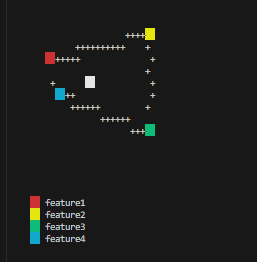

> Bring charts to terminal

## Charts


### Radar


*Here an example of a 6-fetured radar for a typical rpg stat.*
```js
const stats = [{
  name: "STR",
  value: 4
}, {
  name: "DEX",
  value: 1
}, {
  name: "VIT",
  value: 6
}, {
  name: "INT",
  value: 5
}, {
  name: "WIS",
  value: 3
}, {
  name: "HP",
  value: 6
}
];
let { render, labelsWithColors } = radar(stats);
console.log(render);
console.log(annotation(labelsWithColors));
```


Adapts the radar based on the features provided.

```js

const stats4Only = [{
  name: "feature1",
  value: 4
}, {
  name: "feature2",
  value: 6
}, {
  name: "feature3",
  value: 6
}, {
  name: "feature4",
  value: 3
}
];
let dataStast4 = radar(stats4Only);
console.log(dataStast4.render);
console.log(annotation(dataStast4.labelsWithColors));

```




#### Parameters

- `radarData` (required): A list of dictionaries containing radar data.
  - Example:
    ```javascript
    [
      {
        "name": "feature1",
        "value": 8
      }
    ]
    ```

- `width` (optional): Width of the radar chart. Default value is `6`.

- `use_unique_colors` (optional): Determines whether to use unique colors for each feature based on their order. Default value is `false`.

- `default_color` (optional): Color to use if `use_unique_colors` is set to `false`. Default value is `'yellow'`.

- `draw_perimeter` (optional): Whether to draw the perimeter of the radar chart. Default value is `true`.

- `write_labels` (optional): Whether to write labels for features. Default value is `true`.

#### Note

- Values in `radarData` are automatically scaled to a range of 0-6 for calculating distances.


### Dated Heatmap:

Sample Code:


```js

const heatmap_plots = [];
SIZE_SQUARE = 2
WEEKS = 15
for (let i = 1; i < 13; i++) {
  i < 6 ? heatmap_plots.push({ key: '1+', value: [i, i], style: bg('red', SIZE_SQUARE) })
    : heatmap_plots.push({ key: '1+', value: [i, 6], style: bg('red', SIZE_SQUARE) })
}

heatmap_plots.push({ key: '3+', value: [2, 6], style: bg('blue', SIZE_SQUARE)})
heatmap_plots.push({ key: '5+', value: [6, 0], style: bg('cyan', SIZE_SQUARE) })

console.log(heatmap(heatmap_plots, { width: WEEKS , hName: "", vName: "", startsHAxis: 15, left: 4}) + '\n')

```

Results: 


**Data Array**

The data array is an array of objects, where each object represents a data point in the heatmap. Each object in the data array should have the following properties:

- `key` (string): The identifier for the data point. This could be a date, a time, or any other identifier that makes sense for your data.

- `value` (array): An array of two numbers. The first number represents the start of the range for this data point, and the second number represents the end of the range.

- `style` (function): A function that returns a string representing the style to be applied to this data point. The function takes two arguments: a string representing the color, and a constant representing the size of the square.


Default options:

```json
  const newOpts = Object.assign({
    width: 5, //Amount of weeks
    left: 2,
    height: 7,
    style: '# ',
    sides: [1, 1],
    hAxis: ['+', '-', ''],
    vAxis: ['|', ''],
    hName: 'X',
    vName: 'Y',
    zero: '+',
    ratio: [1, 1],
    hGap: 2,
    vGap: 1,
    legendGap:0,
    startsHAxis: 15, //Start on the horizontal Line
    startsVAxis: 1, //Starts on the vertical Line
    VLabels: ['Mo ', 'Tu ', 'We ', 'Th ', 'Fr ', 'Sa ', 'Su ']
  }, opts)
```


### Bar


```js
const barData = [
  { key: 'A', value: 5, style: '*' },
  { key: 'B', value: 3, style: '+' },
  { key: 'C', value: 11 },
  { key: 'D', value: 1, style: bg('red') },
  { key: 'E', value: 5, style: bg('green') },
  { key: 'F', value: 7, style: bg('blue'), padding: 1 },
  { key: 'G', value: 0, style: bg('yellow') }
]

console.log(bar(barData))
```

### Pie


```js

// Pie
const pieData1 = [
  { key: 'A', value: 5, style: '* ' },
  { key: 'B', value: 10, style: '+ ' },
  { key: 'C', value: 10, style: '# ' },
  { key: 'D', value: 10, style: 'O ' }
]

const pieData2 = [
  { key: 'A', value: 5, style: bg('cyan', 2) },
  { key: 'B', value: 5, style: bg('yellow', 2) },
  { key: 'C', value: 5, style: bg('magenta', 2) },
  { key: 'D', value: 5, style: bg('white', 2) }
]

console.log(pie(pieData1, { left: 1 }))
console.log(pie(pieData2, { left: 1 }))
```
### Bullet

```js

const bulletData = [
  { key: 'Month', value: 5 },
  { key: 'Week', value: 3, style: fg('red', '*') },
  { key: 'Day', value: 20, style: bg('blue'), barWidth: 1 },
  { key: 'Now', value: 15, style: bg('cyan'), barWidth: 1 }
```


### Donut

```js
const donutData1 = [
  { key: 'A', value: 10, style: fg('cyan', '+ ') },
  { key: 'B', value: 10, style: fg('red', '* ') }
]
```

```js
const donutData2 = [
  { key: 'A', value: 20, style: bg('green', 2) },
  { key: 'B', value: 20, style: bg('blue', 2) },
  { key: 'C', value: 20, style: bg('yellow', 2) }
]
```


### Gauge

```js
const gaugeData1 = [
  { key: 'A', value: 0.5 }
]

const gaugeData2 = [
  { key: 'PR', value: 0.3 }
]

console.log(gauge(gaugeData1, { radius: 7 }))
console.log(gauge(gaugeData2, {
  radius: 7, style: bg('green', 2), bgStyle: bg('magenta', 2)
}))

```


### Scatter Data


```js
const scatterData = []

for (let i = 1; i < 17; i++) {
  i < 6 ? scatterData.push({ key: 'A', value: [i, i], style: fg('red', '*') })
    : scatterData.push({ key: 'A', value: [i, 6], style: fg('red', '*') })
}

scatterData.push({ key: 'B', value: [2, 6], style: fg('blue', '# '), sides: [2, 2] })
scatterData.push({ key: 'C', value: [6, 9], style: bg('cyan', 2) })

console.log(scatter(scatterData, { legendGap: 18, width: 15 }) + '\n')

```

## APIs

## main function
```js
ervy.[chartType](data, options)
```

## render colored characters
```js
// foreground color
ervy.fg(color, character)

// background color
ervy.bg(color, [length])
```
Supported color: black, red, green, yellow, blue, magenta, cyan and white.

Use [demo](/demo/index.js) to understand how to combine APIs in actual code.

## Credits

It would not be possible without the work of the following people:


[@jcubic](https://github.com/jcubic)
[@chunqiuyiyu](https://github.com/chunqiuyiyu/ervy)

## License
[MIT](./LICENSE)
