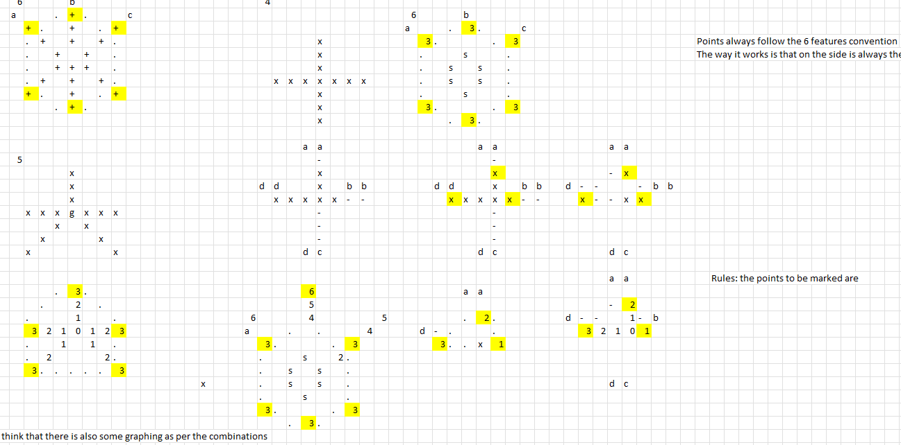
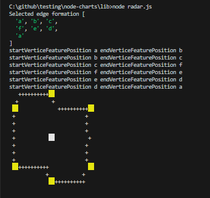
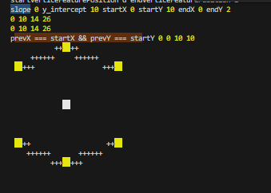

## Optimal formations for the future




>  Here I am figuring out the patterns for each edge.

- Note how is divided on top and bottom.
- With just some padding each oter lines.

## Trying to draw a radar 

### Attempt 1 


### Attempt 2


🤣🤣🤣🤣🤣🤣🤣🤣🤣🤣

Ok here it must be becuase it attempts the wrong orders. It should be 

a -> b -> c -> f -> e -> d -> a


But if you think about it. Each formation has its corresponding order.

Therefore convert the following into one that uses the ordered edges to create instead:


```js
  // Plot the perimeter
  if (draw_perimeter) {
    const perimeter = render_plots.slice(0);
    perimeter.push(perimeter[0]);
    for (let i = 0; i < perimeter.length - 1; i++) {
      let [x1, y1] = perimeter[i];
      const [x2, y2] = perimeter[i + 1];
      const x_diff = x2 - x1;
      const y_diff = y2 - y1;
      const slope = y_diff / x_diff;
      const y_intercept = y1 - slope * x1;
      console.log("Drawing perimeter for ", i, perimeter[i], i + 1, perimeter[i + 1],
        'x_diff', x_diff, 'y_diff', y_diff)

      while(x1 !== x2){
        const y = Math.round(slope * x1 + y_intercept);
        if (plots[y][x1] === undefined) {
          plots[y][x1] = '+';
        }
        x1 += x1 < x2 ? 1 : -1;
      }
    }

  }
```

Lets try again:

```js


  const edgesSorted = {
    1: [],
    2: ['b', 'e'],
    3: [...formations[2], 'a'],
    4: [...formations[3], 'a'],
    5: [...formations[4], 'a'],
    6: [...formations[5], 'a'],
  }

  ...
  const render_plots = {};

  ...
  
  radarData.forEach((feature, index) => {
    const { name, scaled_value, value } = feature;
    const feature_position = selectedFormation[index];
    const [x, y] = getPosition(scaled_value, feature_position);
    const colorForFeature = use_unique_colors ? colors[index] : default_color;
    plots[y][x * 2] = bg(colorForFeature, 2);
    // render_plots.push([x * 2, y]); // To be used for renering the perimeter.
    render_plots[feature_position] = [x * 2, y];
  });

```

That means that I am storing the radar featured position 'a', 'b'... as keys. And the values are the coordinates. 





I can see that the slope in this case is zero.

(End cases)




Which also seems to translate that the y basically starts there (since it has to perform such a big jump).

So my idea is:

- If the slope is exactly 0. Try to draw a line from the startY to the endY with one of increment?.

```js
if (slope == 0) {
        for (let i = startX; i <= endX; i++) {
          plots[startY][i] = bg('white', 2);
        }
      }
```


Now lets see if it works for the other cases.

```bash


C:\github\testing\node-charts\lib\radar.js:145
    for (let edgeIdx = 0; edgeIdx < edgeFormationSelected.length - 1; edgeIdx++) {
                                                          ^

TypeError: Cannot read properties of undefined (reading 'length')
    at module.exports (C:\github\testing\node-charts\lib\radar.js:145:59)
    at Object.<anonymous> (C:\github\testing\node-charts\demo\index.js:170:48)
    at Module._compile (node:internal/modules/cjs/loader:1241:14)
    at Module._extensions..js (node:internal/modules/cjs/loader:1295:10)
    at Module.load (node:internal/modules/cjs/loader:1091:32)
    at Module._load (node:internal/modules/cjs/loader:938:12)
    at Function.executeUserEntryPoint [as runMain] (node:internal/modules/run_main:83:12)
    at node:internal/main/run_main_module:23:47

Node.js v20.9.0

```


```js

edgeFormationSelected = edgesSorted[radarData.length];
for (let edgeIdx = 0; edgeIdx < edgeFormationSelected.length - 1; edgeIdx++) {

```


## Improving the Heatmmapping


Lets see Pandas implemnetation of it

```py
import numpy as np 
from pandas import DataFrame
import seaborn as sns
%matplotlib inline

Index= ['aaa', 'bbb', 'ccc', 'ddd', 'eee']
Cols = ['A', 'B', 'C', 'D']
df = DataFrame(abs(np.random.randn(5, 4)), index=Index, columns=Cols)

sns.heatmap(df, annot=True)

```

U can see that it indicates the index, and passes (our equivalent to an 2D array) with option of selecting what should go thoguh the cols and rows.

We in this case should by default: "set as index the different features"
Set as cols the different weeks (only show pair, and Current.)


