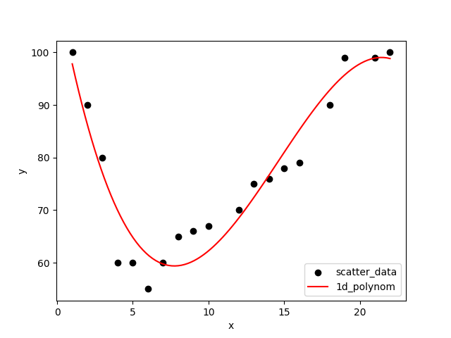
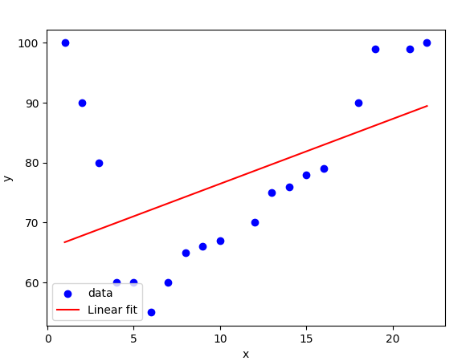
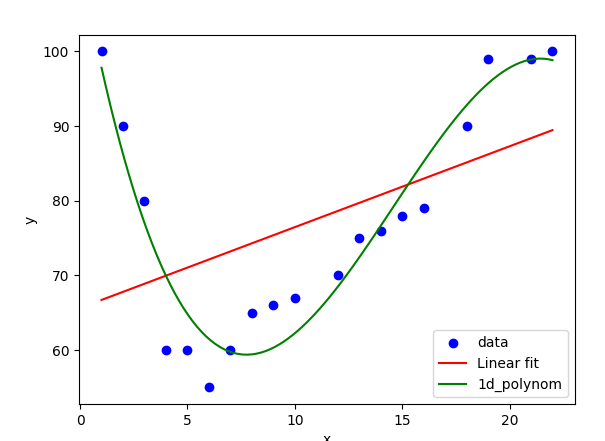
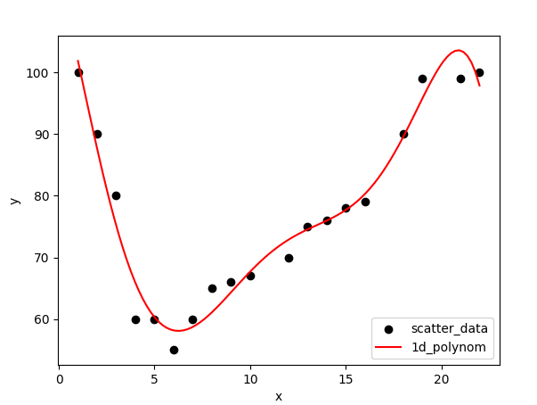
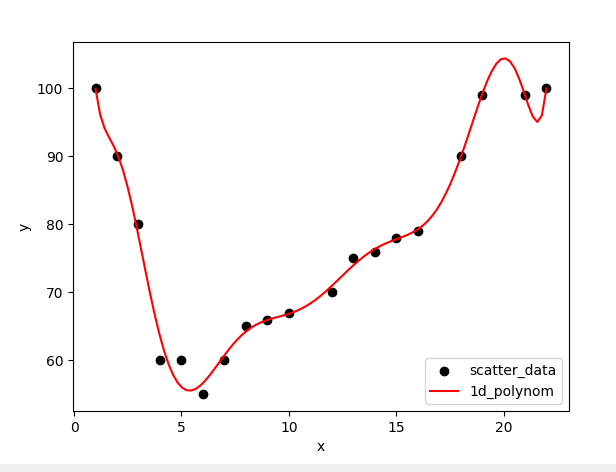
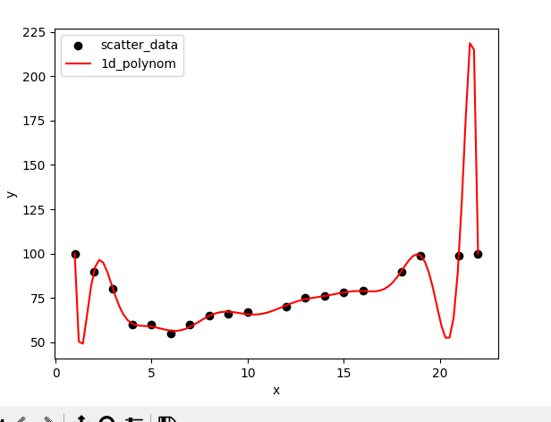

# Question 1

Prompt:

###  Suppose you are given a list x, and a list of corresponding y values
x=[1,2,3,4,5,6,7,8,9,10,12,13,14,15,16,18,19,21,22]
y=[100,90,80,60,60,55,60,65,66, 67, 70,75,76,78,79,90,99,99,100]
import numpy as np
import matplotlib.pyplot as plt
Use these lists to scatter plot the (x,y) values. Then perform a 1d polynom

```py
import numpy as np
import matplotlib.pyplot as plt

# Define the input (x) and output (y) scatter_data
x = [1,2,3,4,5,6,7,8,9,10,12,13,14,15,16,18,19,21,22]
y = [100,90,80,60,60,55,60,65,66, 67, 70,75,76,78,79,90,99,99,100]

# Scatter plot
plt.scatter(x, y, color='black', label='scatter_data')

# Then perform a 1d polynom
deg = 3
coeffs = np.polyfit(x, y, deg)
polynom_1d = np.poly1d(coeffs)

# Plot the polynomial

# Range of the polynomial
myline= np.linspace (1,22,100)
plt.plot(myline, polynom_1d(myline), color='red', label='1d_polynom')
plt.legend()
plt.xlabel('x')
plt.ylabel('y')
plt.show()

```

Plots:



From what I can see is that the slope and the line fits barely the plots in , creating an aproximate polynomial function. The line is not a good fit for the data, but it is a good approximation.

### Question 2:

Derive your own algorithm to fit a third deg polynomial.
Write your own python code to do the fit.
(You have to solve a set of linear equations in 4 unknowns, where the coefficients of the unknowns
depend on the data)
Display it.
Compare to the numpy library fit. Are there differences?


So what I tried developing was a simple linear fitting algorithm, that would the data as best as it could.




As we can see that there seems to be a correlation between the data and the line, but it is not not a good fit as there seems to be outliers at the start.that messes the deviation of the line.

Comparing:


However, while I am confident that I am avoiding overfitting the data, as the line is not a good fit for the data. However it might be not representative of what is really occuring, as the first 3 points, are very poorly fitted to the line.


## Comparing The effects of adding degrees

| Degrees | Image                                 |
| ------- | ------------------------------------- |
| 6       |  |
| 12      |  |
| 15      |  |


