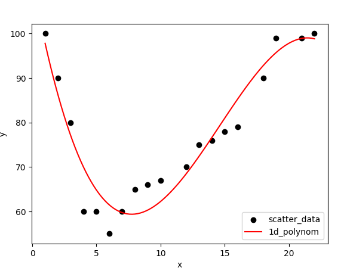

Prompt
Assignment 6
Question 1:
# Suppose you are given a list x, and a list of corresponding y values

```py
x=[1,2,3,4,5,6,7,8,9,10,12,13,14,15,16,18,19,21,22]
y=[100,90,80,60,60,55,60,65,66, 67, 70,75,76,78,79,90,99,99,100]
import numpy as np
import matplotlib.pyplot as plt

```


- Use these lists to scatter plot the (x,y) values. Then perform a 1d polynomial fit of degree deg
(np.polyfit (x,y, deg) and np.poly1d to create a model (mymodel)

- create a line of 100 points from x=1 to x=22.
myline= np.linspace (1,22,100)
then do a scatter plot:
plt.scatter (x,y)
then do a plot of the model fit:
plt.plot (myline, mymodel(myline))
Then show the plot:
plt.show().


Show the plots for increasing degrees of the polynomial and explain your findings.



- Seems that the 1d 


### Question 2:

Question 2:

Derive your own algorithm to fit a third deg polynomial.

(You have to solve a set of linear equations in 4 unknowns, where the coefficients of the unknowns depend on the data)
- Write your own python code to do the fit.
- Display it.
- Compare to the numpy library fit. Are there differences?

My own Linera Fit:

The idea was just to create the closest linear fit to the data, by using the least squares method. I used the formula for the least squares method, and then I used the numpy library to create the polynomial fit. I then compared the two, and they were very similar, but the numpy library was more accurate.


