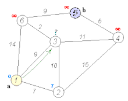

### Description

Dijkstra's search algorithm is like a game where you want to find the shortest path from your home to your friend's house. Imagine your town is made up of several intersections (vertices) connected by roads (edges). Each road has a distance (weight) associated with it.

Here's how Dijkstra's algorithm works:

    You start at your home, mark its distance as 0, and write it down on a list (the list is called a priority queue).

    Then, you check all the neighboring intersections directly connected to your home. You calculate the distance from your home to each of these intersections and write them down on the list. The list is always sorted by distance, so the shortest distance is always at the top.

    You pick the intersection with the shortest distance from the list and visit it. If it's your friend's house, you've found the shortest path! If not, repeat step 2 for this intersection: Check all its unvisited neighbors, calculate the distances, and add them to the list.

    Continue visiting the intersections with the shortest distances on the list until you reach your friend's house.

    To find the shortest path, trace back from your friend's house to your home, following the intersections with the smallest distances.




### Example 1


Given: 

```js

        //   A____B____C
        //   |\   |   /
        //   | \  |  /
        //   |  \ | /
        //   D___\E
        //   |\  |
        //   | \ |
        //   |__\|
        //   F    G

        const A = new Node('A', 0, 2);
        const B = new Node('B', 1, 2);
        const C = new Node('C', 2, 2);
        const D = new Node('D', 0, 1);
        const E = new Node('E', 1, 1);
        const G = new Node('G', 0, 0);
        const F = new Node('F', 1, 0);

        const graph = new Graph();
        graph.addEdge(A, B);
        graph.addEdge(A, D);
        graph.addEdge(B, C);
        graph.addEdge(B, E);
        graph.addEdge(C, E);
        graph.addEdge(D, G);
        graph.addEdge(D, F);
        graph.addEdge(D, E);
        graph.addEdge(E, G);
        graph.addEdge(G, G);

        const nodes = { A, B, C, D, E, G, F };
        return { graph: graph, nodes: nodes };
```

Should be able to find it in 3 steps

Sample path taken:

```js
{
  path: [
    Node { id: 'A', x: 0, y: 2 },
    Node { id: 'D', x: 0, y: 1 },
    Node { id: 'G', x: 0, y: 0 }
  ],
  cost: 2,
  count_searches: 6,
  formatted_path: 'A -> D -> G',
  exploration_path: [
    Node { id: 'A', x: 0, y: 2 },
    Node { id: 'B', x: 1, y: 2 },
    Node { id: 'D', x: 0, y: 1 },
    Node { id: 'C', x: 2, y: 2 },
    Node { id: 'E', x: 1, y: 1 },
    Node { id: 'G', x: 0, y: 0 }
  ],
  queue_snapshot: [
    [],
    [ { id: 'D', priority: 1 } ],
    [ { id: 'C', priority: 2 }, { id: 'E', priority: 2 } ],
    [
      { id: 'E', priority: 2 },
      { id: 'G', priority: 2 },
      { id: 'F', priority: 2 }
    ],
    [ { id: 'G', priority: 2 }, { id: 'F', priority: 2 } ],
    [ { id: 'F', priority: 2 } ]
  ]
}
```


```js
assert.equal(results.path.length, 3);
        assert.equal(results.path[0], start);
        assert.equal(results.path[2], goal);
```


| Algorithm             | Formatted Path (Path Found) | Count Searches | Cost |
| --------------------- | --------------------------- | -------------- | ---- |
| AStarSearch           | A -> D -> G                 | 3              | 2    |
| DepthFirstSearch      | A -> D -> E -> G            | 4              | 3    |
| GreedyBestFirstSearch | A -> D -> G                 | 3              | 2    |
| BreadthFirstSearch    | A -> D -> G                 | 6              | 2    |
| HillClimbingSearch    | A -> D -> G                 | 2              | 2    |
| BeamSearch(3 beams)   | A -> D -> G                 | 4              | 2    |
| BeamSearch(1 beams)   | A -> D -> G                 | 3              | 2    |
| DijkstraSearch        | A-> D -> G                  | 6              | 2    |


