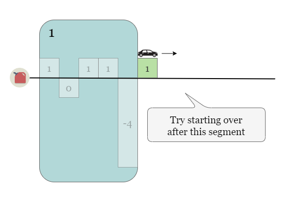
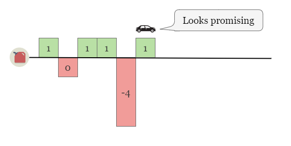

### Description

There are `n` gas stations along a circular route, where the amount of gas at the `ith` station is `gas[i]`.

You have a car with an unlimited gas tank and it costs `cost[i]` of gas to travel from the `ith` station to its next (i + 1)th station. You begin the journey with an empty tank at one of the gas stations.

Given two integer arrays `gas` and `cost`, return the starting gas station's index if you can travel around the circuit once in the clockwise direction, otherwise return `-1`. If there exists a solution, it is guaranteed to be unique

### Example 1

```bash
Input: gas = [1,2,3,4,5], cost = [3,4,5,1,2]
Output: 3
Explanation:
Start at station 3 (index 3) and fill up with 4 unit of gas. Your tank = 0 + 4 = 4
Travel to station 4. Your tank = 4 - 1 + 5 = 8
Travel to station 0. Your tank = 8 - 2 + 1 = 7
Travel to station 1. Your tank = 7 - 3 + 2 = 6
Travel to station 2. Your tank = 6 - 4 + 3 = 5
Travel to station 3. The cost is 5. Your gas is just enough to travel back to station 3.
Therefore, return 3 as the starting index.
```

### Example 2

```bash
Input: gas = [2,3,4], cost = [3,4,3]
Output: -1
Explanation:
You can't start at station 0 or 1, as there is not enough gas to travel to the next station.
Let's start at station 2 and fill up with 4 unit of gas. Your tank = 0 + 4 = 4
Travel to station 0. Your tank = 4 - 3 + 2 = 3
Travel to station 1. Your tank = 3 - 3 + 3 = 3
You cannot travel back to station 2, as it requires 4 unit of gas but you only have 3.
Therefore, you can't travel around the circuit once no matter where you start.
```

### Constraints:

- n == gas.length == cost.length
- 1 <= n <= 10^5
- 0 <= gas[i], cost[i] <= 10^4


## Umpire

### Understand



THe idea is that we can think of it as segments of gas stations. If we can't complete a segment, then we try starting from the next one. Eventually we find out that if it is possible to complete the circuit, then the starting point is the one that has the most gas left. (the only possible segment)




### Implement

<iframe src="" width="100%" height="600" frameborder="0" marginwidth="0" marginheight="0" allowfullscreen></iframe>

<Tabs>
<TabItem value="Javascript Naive" label="JavaScript">

```js
var canCompleteCircuit = function(gas, cost) {
    
    let startPoint = 0;
    let totalGas = 0;
    let currentSegmentGas = 0;
    for(let i = 0; i < gas.length; i++){
        const currentGain = gas[i] - cost[i];
        totalGas += currentGain;
        currentSegmentGas += currentGain;
        
        if(currentSegmentGas < 0){
            startPoint = i+1;
            currentSegmentGas = 0;
            
        }
           
           
        
    }
    return totalGas>=0?startPoint:-1;
    
};
```

</TabItem>
<TabItem value="Javascript Optimized" label="Javascript Optimized">

```js

```

</TabItem>
<TabItem value="Python" label="Java">

```java

```

</TabItem>
</Tabs>

### Review if your code is ok

### Evaluate

- [ ] Time Complexity
- [ ] Space Complexity