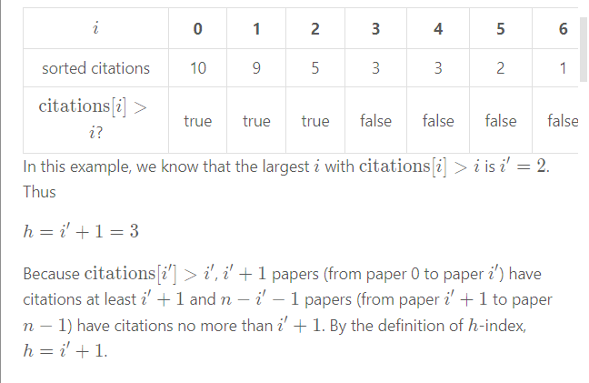

### Description

Given an array of integers citations where citations[i] is the number of citations a researcher received for their ith paper, return the researcher's h-index.

According to the definition of h-index on Wikipedia: The h-index is defined as the maximum value of h such that the given researcher has published at least h papers that have each been cited at least h times.

### Example 1

```bash
Input: citations = [3,0,6,1,5]
Output: 3
Explanation: [3,0,6,1,5] means the researcher has 5 papers in total and each of them had received 3, 0, 6, 1, 5 citations respectively.
Since the researcher has 3 papers with at least 3 citations each and the remaining two with no more than 3 citations each, their h-index is 3.
```


### Example 2

```bash
Input: citations = [1,3,1]
Output: 1
```

## Umpire

### Understand

Since we know that the smallest elemnt will have all the count of numbers largr than it counting as index counts. We know also that in reverse (larger -> smaller) sort the largest element will only have itself as count, if the count is larger equal than the value of that elment it would make it the h-index and all consecutive h-indexes would be smaller than it.



By sorting them in reverse you can eventually go finding up the counts.

### Implement

<iframe src="" width="100%" height="600" frameborder="0" marginwidth="0" marginheight="0" allowfullscreen></iframe>

<Tabs>
<TabItem value="Javascript Naive" label="JavaScript">

```js
/**
 * @param {number[]} citations
 * @return {number}
 */
var hIndex = function(citations) {
    
    citations.sort((a, b) => b - a)
    let i = 0
    while (i<citations.length && i < citations[i] ){
        i++;
    }
    return i;
    
};

```

</TabItem>
<TabItem value="Javascript Optimized" label="Javascript Optimized">

```js

```

</TabItem>
<TabItem value="Python" label="Java">

```java

```

</TabItem>
</Tabs>

### Review if your code is ok

### Evaluate

- [ ] Time Complexity
- [ ] Space Complexity